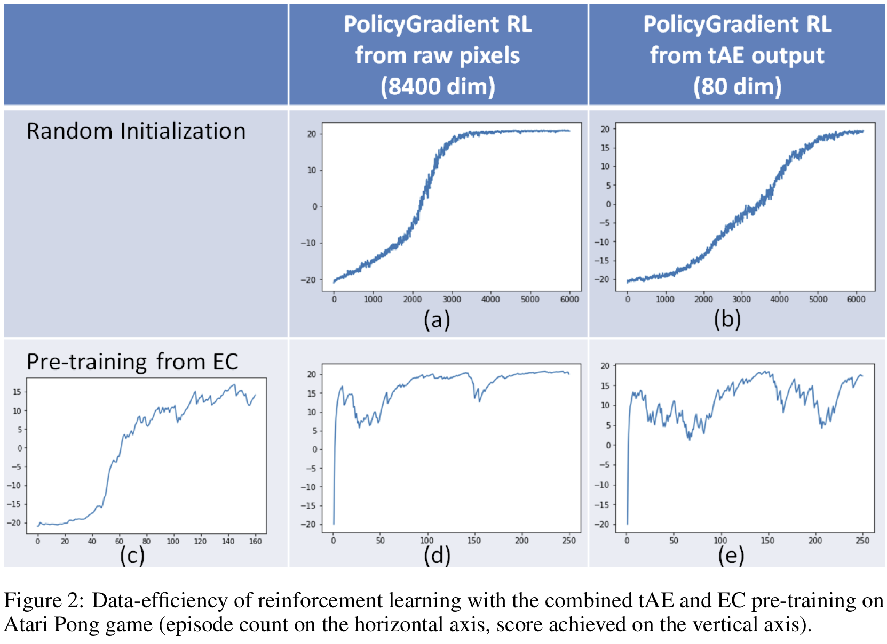

### Explanation how graphs in Fig2 can be reproduced:

(c) is produced with 1ECexplore.ipynb file. This also produces game-play
recording files necessary for producing graphs (b), (d), (e).

(a) is produced with 2Karpathy.ipynb code by deleting the line "immitate()" to
force random initialization of reinforcement learning weights.

(b) is produced with 3tAE.ipynb code by deleting the line "immitate()" to force
random initialization of reinforcement learning weights.
tAE is pre-trained from the game-play files produced in (c)

(d) is produced with 2Karpathy.ipynb code.
Reinforcement learning weights are pre-trained in supervised manner from
game-play files produced in (c)

(e) is produced with 3tAE.ipynb code
Both tAE and reinforcement learning weights are pre-trained in supervised manner
from game-play files produced in (c)

Code requires CUDA on GPU with 12GB of DRAM.
The host system requires 32GB RAM + 128GB swap space.
